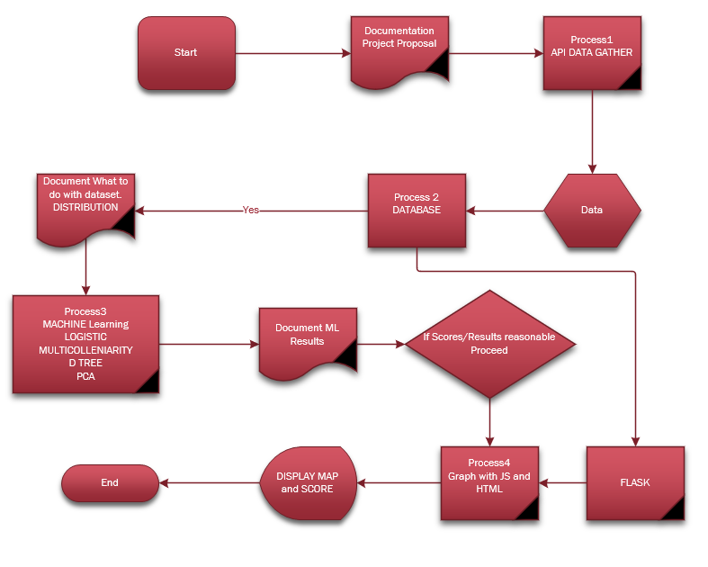

# Internet_Access_Analysis

## Project Overview

In a time when the internet is connected to innovation, job growth, working from home and education, internet accessibility is essential. 
However, analyses from the Pew Research Center and other studies indicate that a digital divide exists in the U.S., with [around 10 percent of Americans without internet access](https://www.pewresearch.org/fact-tank/2019/04/22/some-americans-dont-use-the-internet-who-are-they/) and others facing [gaps in internet speed](https://www.pcmag.com/news/these-us-rural-areas-have-the-highest-and-lowest-internet-speeds), [consistently unreliable internet](https://thenevadaindependent.com/article/in-rural-nevada-bridging-the-education-digital-divide-largely-means-improving-internet-access), among other problems.

### Purpose

This analysis determines the factors that play a role in internet connectivity within a community using machine learning.
The project's goal is to use the analysis to inform a model that can help communities determine the best approaches to bringing more people online.
The model will be a dashboard that individuals can interact with to increase internet coverage by targeting the factors identified with the analysis.

## Resources
- Data Source:
  - `filetobeloaded.csv` retrieved from the [U.S. Census Bureau's 2018 American Community Survey data](https://api.census.gov/data/2018/acs/acs5/profile/examples.html) using an API request.
  - The folders `definitions`, `fcc` and `mappings` within the `resources` folder, contain data retrieved from the [Federal Communications Commission Broadband Database](https://broadbandmap.fcc.gov/#/).
    - The `definitions` folder includes urban vs. rural designations for areas from the 2010 U.S. Census.
    - The `fcc` folder contains area mappings by county, technology type, internet speed and number of internet providers from the FCC.
    - The `mappings` folder includes GEOID mapping tables and relevant geography codes used by the FCC.
- Code: 
  - The ETL code for pulling the U.S. Census data with an API key for the state of California and placing it into a dataframe is in the `census_api.ipynb` file located within the `notebook` folder.
  - The Machine Learning code to [specific description here] is in the `internet_access_ensemble.ipynb` file within the `notebook` folder.
  
- Software:
  - JupyterNotebook, Python, Pandas, SciKit...
  - Database storage SQL: PgAdmin
  - Dashboard: Flask, JavaScript, HTML, Tableau?
## Workflow

### Communication Protocols
- Meetings
  - Weekly large group and small group meetings; large group meets on zoom on Wednesdays and Sundays; small groups meet 1-2 times a week at the convenience of group members.
  -  Group breakdown:
     -  Machine Learning Team = Tabitha, David, Tara
     -  Database Team = TC, Andrew
  - Communicate with whole group and small groups through Slack Channels and DMs
  - [Google Shared Folder](https://drive.google.com/drive/folders/1iTgYdopYC7-NkrwVKEIwUNZN5K2RShPh?usp=sharing) available to all members with notes from meetings and documentation of process
- GitHub Protocols
  - Members working on the same files need to communicate any commits with the other parties.
  - Team members within the Machine Learning Team and the Database team communicate when they are pulling to main.
  - A pull request must be approved by at least one member of the overall team.
  - After a pull request is approved, the person who made the request can merge it with the main branch.
  - Group members will create new branches in the format name/new_project_piece_name every time he or she is beginning a new/unique part of project.
  - Group members must ensure that they are working from the latest update to the main branch with protocols outlined in the `github_protocols.txt` file within the `GitHub` folder.

### Block Diagram
- Process documentation plan for the project

  

### Machine Learning Model
- Preprocess and encode data, train the model, classification/ensemble model

### Database Creation
- Will describe the database creation and data storage plan here (once it is more finalized).
## Output
- Sample of what the dashboard will look like.
  Users will be shown a map of the state which they can then use to click into a specific county and view the internet coverage score of that particular county along with bars of factors that they can adjust to see if the coverage score will increase.

  The three bars above the "County Specific Details" are where we hope to add in scenarios that could simulate what might shift in a community if there is an economic depression, fire or anything else that could affect the factors we identified.
    Users could then see what factors they could adjust to increase connectivity if one of the scenarios took place.
  
  