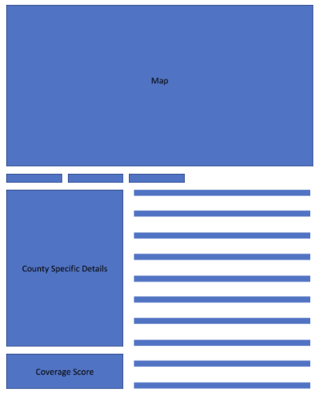

# Internet_Access_Analysis

## Project Overview

In a time when the internet is connected to innovation, job growth, working from home and education, internet accessibility is essential. 
However, analyses from the Pew Research Center and other studies indicate that a digital divide exists in the U.S., with [around 10 percent of Americans without internet access](https://www.pewresearch.org/fact-tank/2019/04/22/some-americans-dont-use-the-internet-who-are-they/) and others facing [gaps in internet speed](https://www.pcmag.com/news/these-us-rural-areas-have-the-highest-and-lowest-internet-speeds), [consistently unreliable internet](https://thenevadaindependent.com/article/in-rural-nevada-bridging-the-education-digital-divide-largely-means-improving-internet-access), among other problems.

### Purpose

This analysis determines the factors that play a role in internet connectivity within a community using machine learning.
The project's goal is to use the analysis to inform a model that can help communities determine the best approaches to bringing more people online at higher download speeds.
The model will be a dashboard that individuals can interact with to increase internet coverage by targeting the factors identified with the analysis.

To learn more, please visit this [Google Slides Presentation](https://docs.google.com/presentation/d/1gCSftL6c0bIMByRA-rVEHvnzC5L0ShjduuX5g1dd13U/edit?usp=sharing) displaying the workflow, project parameters and analysis among other related topics.

## Resources
- Data:
  - The  `resources` folder holds preliminary data not stored in AWS and other information.
  - The `census_api` folder, contains census data from the state of California in csv format retrieved from the [U.S. Census Bureau's 2018 American Community Survey data](https://api.census.gov/data/2018/acs/acs5/profile/examples.html) using an API request.
  - The `definitions` folder includes urban vs. rural designations for areas from the 2010 U.S. Census.
  - The `fcc` folder contains data retrieved from the [Federal Communications Commission Broadband Database](https://broadbandmap.fcc.gov/#/). It contains area mappings by county, technology type, internet speed and number of internet providers from the FCC.
  - The `mappings` folder includes GEOID mapping tables and relevant geography codes for mapping the counties.
  - The `regression_ml_model` has the data used to run regressions and correlation analyses.
  - `usda` contains data for urban and rural designations as defined by the USDA.
- Code: 
  - All code lies within the `notebook` folder.
  - The ETL code for pulling the U.S. Census data with an API key for the entire U.S. and storing it within AWS is in the `census_api.ipynb` file.
  - Code used to cleanup and organize the FCC data is within `fcc_data_cleanup.ipynb`
  - `scaled_merged_internet_access_df.ipynb` has the code used to combine all the various census csv files for processing with machine learning.
  - `multiple_linear_regression.ipynb` contains the multiple linear regression model and feature importance code.
  - Code to cleanup the USDA data is within the `usda_data_cleanup.ipynb`.
  - Code for visualizing and looking over the data with box and whisker plots and other graphs is in `visualizations.ipynb`.
  
- Software:
  - JupyterNotebook, Python, Pandas, SciKit, Numpy, Seaborn, Matplotlib, Sklearn, Requests, Pathlib, Collections, Imblearn
  - Database storage SQL: AWS, PgAdmin
  - Dashboard: Flask, JavaScript, HTML, Tableau
## Workflow

- Process documentation
  
  

## Data Source Rationale
- Census data was obtained to examine community demographics and whether those demographics affect internet download speeds.
- FCC data was a reliable source of information related to internet access, including: bandwidth, download speeds, and internet technology used.
## Database Creation
- Will describe the database creation and data storage plan here in-depth (once it is more finalized).
- We are using AWS to store data, will talk with TC to complete a write up and include an image of the primary and foreign key links..

## Data Preparation
- Describe data preparation here and analysis 
- Discuss the factors that we are actually looking at
- Creating the Internet Access Target Score

### Machine Learning Model
- Preprocess and encode data, train the model, classification/ensemble model
- Still need to update the machine learning model descriptions and give insight into which ones we are selecting, but we are still in the process of developing some of our models.
## Output
- Sample of what the dashboard will look like.
  Users will be shown a map of the state which they can then use to click into a specific county and view the internet coverage score of that particular county along with bars of factors that they can adjust to see if the coverage score will increase.

  The three bars above the "County Specific Details" are where we hope to add in scenarios that could simulate what might shift in a community if there is an economic depression, fire or anything else that could affect the factors we identified.
    Users could then see what factors they could adjust to increase connectivity if one of the scenarios took place.
  
  

## Future Steps
- Describe future steps...