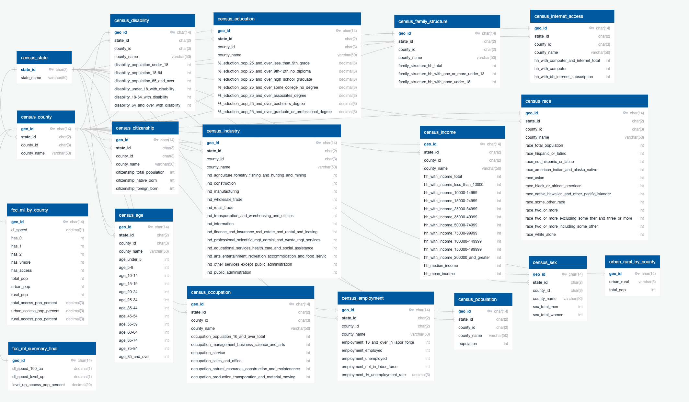

# Internet_Access_Analysis

## Project Overview

In a time when the internet is connected to innovation, job growth, working from home and education, internet accessibility is essential. 
However, analyses from the Pew Research Center and other studies indicate that a digital divide exists in the U.S., with [around 10 percent of Americans without internet access](https://www.pewresearch.org/fact-tank/2019/04/22/some-americans-dont-use-the-internet-who-are-they/) and others facing [gaps in internet speed](https://www.pcmag.com/news/these-us-rural-areas-have-the-highest-and-lowest-internet-speeds), [consistently unreliable internet](https://thenevadaindependent.com/article/in-rural-nevada-bridging-the-education-digital-divide-largely-means-improving-internet-access), among other problems.

### Purpose

This analysis determines the factors that play a role in internet connectivity within a community using machine learning.
The project's goal is to use the analysis to inform a model that can help communities determine the best approaches to bringing more people online at higher download speeds.
The model will be a dashboard that individuals can interact with to increase internet coverage by targeting the factors identified with the analysis.

To learn more, please visit this [Google Slides Presentation](https://docs.google.com/presentation/d/1gCSftL6c0bIMByRA-rVEHvnzC5L0ShjduuX5g1dd13U/edit?usp=sharing) displaying the workflow, project parameters and analysis among other related topics.

## Resources
- **Data:**
  - All tables used in the project are stored in AWS and accessed through PGAdmin through a group login.
  - The  `resources` folder holds preliminary and exploratory data/
  - The `census_api` folder, contains census data from the state of California in csv format retrieved from the [U.S. Census Bureau's 2018 American Community Survey data](https://api.census.gov/data/2018/acs/acs5/profile/examples.html) using an API request. Data for the entire U.S. is stored in AWS.
  - The `definitions` folder includes urban vs. rural designations for areas from the 2010 U.S. Census.
  - The `fcc` folder contains data retrieved from the [Federal Communications Commission Broadband Database](https://broadbandmap.fcc.gov/#/). It contains area mappings by county, technology type, internet speed and number of internet providers from the FCC for California, all state data is contained in AWS.
  - The `mappings` folder includes GEOID mapping tables and relevant geography codes for mapping California counties.
  - The `regression_ml_model` has the data used to run regressions and correlation analyses.
  - `usda` contains data for urban and rural designations as defined by the USDA.
- **Code:** 
  - All code lies within the `notebook` folder.
  - The ETL code for pulling the U.S. Census data with an API key for the entire U.S. and storing it within AWS is in the `census_api.ipynb` file.
  - Code used to cleanup and organize the FCC data is within `fcc_data_cleanup.ipynb`
  - `scaled_merged_internet_access_df.ipynb` has the code used to combine all the various census csv files for processing with machine learning.
  - `multiple_linear_regression.ipynb` contains the multiple linear regression model and feature importance code.
  - `internet_access_machine_learning.ipynb` holds the random forest regression machine learning code.
  - Code to cleanup the USDA data is within the `usda_data_cleanup.ipynb`.
  - Code for visualizing and looking over the data with box and whisker plots and other graphs is in `visualizations.ipynb`.
  
- **Software:**
  - JupyterNotebook, Python, Pandas, SciKit, Numpy, Seaborn, Matplotlib, Sklearn, Requests, Pathlib, Collections, Imblearn
  - Database storage SQL: AWS, PgAdmin
  - Dashboard: Flask, JavaScript, HTML, Tableau
## Workflow

- Process documentation
  
  

## Data Source Rationale
- Census data was obtained to examine community demographics and whether those demographics affect internet download speeds.
- FCC data was a reliable source of information related to internet access, including: bandwidth, download speeds, and internet technology used.
- We are also in the process of gathering more data such as the lat/long, GDP, and other factors that exist outside of the Census data that might have an affect on internet connectivity.
## Database Creation
- Database was created using AWS and can be accessed through a group login. Our team chose to access the data with PGAdmin.
- The image of our database setup is below:
  
  

## Data Preparation
- To understand what the data looked like, we ran visualization analyses such as box and whisker plots, correlation matrix, converted total population data to be per capita and used conditional formatting in Excel to further visualize our analysis.
- For the initial timeline of this project, we identified the baseline for a given county where 100 percent of the population had access to an internet download speed. 
  We then decided to make our first target score the percent of population with access to the next highest level of internet download speed in megabits per second. 
  In the future, we will run further analyses to incorporate other factors in a more all-encompassing internet access score as described in the future steps section of this readme.
### Machine Learning Model
- We looked at a few different model types such as Easy Ensemble AdaBoost, Oversampling and Undersampling. However, the model that fit our project the best was Multiple Linear Regression and Random Forest Decision Trees.
- We chose Multiple Linear Regression and Random Forest Decision Trees because these models offer the ability to visualize multiple predictor variables for feature importance and run efficiently on vast data sets.
- Multiple linear regression results:
  - CA
  
  

  - USA
  
  

- Random forest decision tree:
  - CA
  
  

  - USA
  
  

- The models returned that there were strong multicollinearity problems with the dataset and more time needs to be spent on cleaning it up.  The ca regression model had a 6% mean squared error and the usa regression model returned 3%.  The random forest model returned a 93% accuracy score and 100% percision score for internet access above 70% on the ca dataset and a 78% accuracy score with a 84% percision score for internet access above 70%.
## Output
- Click here for the [Tableau Dashboard](https://public.tableau.com/profile/tc1059#!/vizhome/InternetMockUp/Dashboard1?publish=yes) and for a mockup of our website follow [this link](https://sloth143chunk.github.io/Internet_Access_Analysis/).
- The goal of this project will be to have users view a map of the all counties within the U.S. which they can then use to click into a specific county and view the internet coverage score of that particular county along with bars of factors that they can adjust to see if the coverage score will increase.
## Future Steps
- We are still developing our dashboard, and have not finalized the adjustable factors for each particular county within the U.S. 
- To create the adjustable factors, we will need to download more data and run further analyses to determine other factors playing a role in internet access included but not limited to latitude and longitude, provider reliability, technology access, new forms of internet, areas falling within opportunity zones, GDP changes over time and other data not contained within the FCC or Census databases.
- We also want to explore more ways to visualize data surrounding populations with less access to the internet and how natural and economic disasters affect that access.